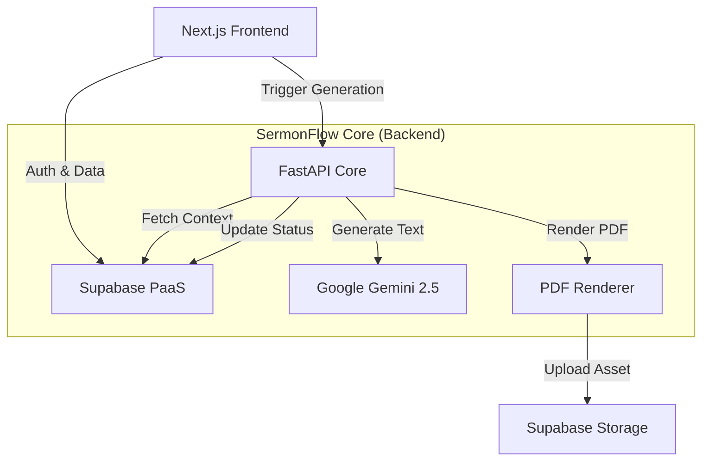

# SermonFlow Master Technical Specification

## 1. System Overview
SermonFlow is a stateless, containerized backend service responsible for the "heavy lifting" of content generation. It connects to Supabase for data and Google Gemini for intelligence, producing high-fidelity PDF assets from raw sermon transcripts.

## 2. Architecture
The system follows a stateless, containerized microservices pattern.



## 3. Tech Stack
*   **Frontend**: Next.js 14 (App Router), React, Tailwind CSS, Lucide Icons.
*   **Backend**: Python 3.11, FastAPI, Pydantic, reportlab (for PDF).
*   **Database**: PostgreSQL (via Supabase).
*   **Auth**: Supabase Auth (Google OAuth / Email).
*   **Storage**: Supabase Storage (S3-compatible).
*   **AI**: Google GenAI SDK (`google-genai`), Model: `gemini-2.5-flash`.

## 4. Database Schema
The database is hosted on Supabase and consists of three primary tables.

### 4.1. `public.churches`
Stores configuration and branding for each onboarded church.
| Column | Type | Description |
| :--- | :--- | :--- |
| `id` | UUID | Primary Key (Default: `uuid_generate_v4()`) |
| `name` | Text | Display name of the church |
| `deep_research_profile` | JSONB | Contains `insider_lexicon`, `theology`, `voice_tone`, etc. |
| `branding_assets` | JSONB | Contains `primary_color`, `font_header`, `logo_url`, etc. |
| `created_at` | Timestamptz | Creation timestamp |

### 4.2. `public.sermons`
Stores the raw input data (transcripts).
| Column | Type | Description |
| :--- | :--- | :--- |
| `id` | UUID | Primary Key |
| `church_id` | UUID | FK to `churches.id` |
| `transcript` | Text | Full text of the sermon |
| `title` | Text | Sermon title |
| `series_title` | Text | (Optional) Series name |
| `created_at` | Timestamptz | Creation timestamp |

### 4.3. `public.assets`
Stores the output generated artifacts.
| Column | Type | Description |
| :--- | :--- | :--- |
| `id` | UUID | Primary Key |
| `sermon_id` | UUID | FK to `sermons.id` |
| `type` | Text | Schema: `email_recap`, `devotional`, `small_group`, etc. |
| `content_markdown` | Text | The raw LLM output |
| `pdf_url` | Text | Public URL to the generated PDF |
| `status` | Text | Enum: `processing`, `completed`, `failed` |
| `error` | Text | Error message if failed |
| `created_at` | Timestamptz | Creation timestamp |

## 5. Backend API Reference
Base URL: `http://localhost:8000` (Local)

### 5.1. `POST /generate-asset`
Triggers the synchronous generation process.

**Request:**
```json
{
  "sermon_id": "uuid-string",
  "asset_type": "email_recap" // One of supported types
}
```

**Response:**
```json
{
  "status": "success",
  "asset_id": "uuid-string",
  "pdf_url": "https://[supabase-project].supabase.co/storage/v1/object/public/sermon-assets/..."
}
```

**Supported Asset Types:**
Mapped to templates in `app/prompts/{type}.md`:
1.  `email_recap`
2.  `devotional`
3.  `small_group`
4.  `family_discussion`
5.  `guest_follow_up`
6.  `service_host`

## 6. Frontend Structure
Directory: `frontend/`

*   **Pages**:
    *   `/login`: User authentication.
    *   `/dashboard`: List of sermons (implied).
    *   `/dashboard/new`: Form to upload a new sermon transcript.
    *   `/dashboard/sermon/[id]`: The main "Workspace" view. Contains:
        *   **Left Panel**: Transcript preview.
        *   **Right Panel**: Grid of 6 generation buttons + Live list of generated assets.

## 7. Configuration Variables
Required environment variables (`.env`).

### Backend (`app/.env`)
*   `SUPABASE_URL`: API URL.
*   `SUPABASE_KEY`: Service role or Anon key (Backend uses Service Role usually).
*   `GEMINI_API_KEY`: Google AI Studio Key.

### Frontend (`frontend/.env.local`)
*   `NEXT_PUBLIC_SUPABASE_URL`: API URL.
*   `NEXT_PUBLIC_SUPABASE_ANON_KEY`: Public API Key.
